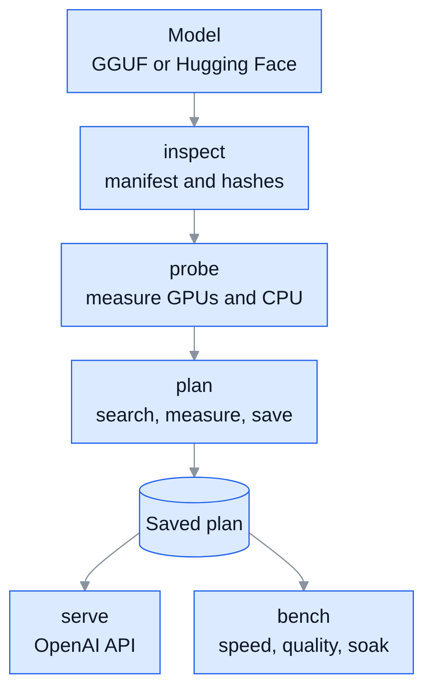
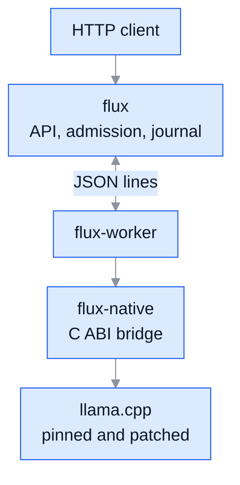

<p align="center">
  
</p>

<h1 align="center">Flux</h1>

<p align="center"><b>Squeezes every last token out of your machine.</b></p>

Flux is a measured execution planner and runtime for LLM inference. It measures your GPUs, CPU, and storage, searches placements of a model's layers and mixture-of-experts weights across them, times the fastest candidates on real prompts, and saves the winner as an immutable plan. When a model outgrows RAM, you can let the plan stream the remaining weights from an NVMe drive. `flux serve` then runs that plan behind an OpenAI-compatible API.

Cost models only rank and prune candidates; Flux always saves the plan that measured fastest. It runs on a pinned, patched build of [llama.cpp](https://github.com/ggml-org/llama.cpp) and can also plan for `llama-server` or any OpenAI-compatible engine you configure.

<p align="center">
  
</p>

## Compared with hand-tuned engines

| | Flux | Hand-tuned single-model engines |
|---|---|---|
| Models | Any of the 148 architectures the pinned llama.cpp implements | The one model they were tuned for |
| Ready to serve | In seconds: weights are memory-mapped and page-locked in the background; 15 s for Qwen3.8-Flash-Next on an RTX 2060 + RTX 3060 | Minutes: the experts are read into RAM before the first request, longest on a cold start |
| CPU's share of the work | Measured on your machine: RAM bandwidth per thread count and the model's own kernels | Fixed constants; an optional calibration run adjusts a few of them |
| Layer and expert placement | Searched across the CPU and GPUs; the finalists are timed on real prompts | Fixed rules decide each token's split |
| Several GPUs | Splits layers across GPUs and caches experts on them, in the same plan | A layer split or extra expert caches, one at a time |
| Engine | Compares its native engine, `llama-server`, and any engine you register, then keeps the fastest | One engine |
| Models bigger than RAM | Measures the drive that holds the model and predicts the decode limit of reading weights from it; opt in with `--allow-storage-streaming` | A low-RAM mode chosen from the amount of RAM, without testing the drive |
| Changes while serving | Watches decode speed and can replan in place | Calibration runs only when you start it |

## Requirements

| Component | Requirement |
|---|---|
| OS | Linux x86_64 |
| Rust | 1.85 or newer |
| Build tools | CMake, a C++17 compiler, and git |
| GPU | An NVIDIA GPU and the CUDA toolkit for the default build; set `GGML_CUDA=OFF` to build for CPU only |
| Python | Python 3 with `torch`, `numpy`, and `transformers`, needed only by `flux convert` |

## Supported models

Flux runs any GGUF file whose `general.architecture` the pinned llama.cpp implements: 148 architectures at the current pin, including the Llama, Qwen3, Qwen3-Next, Gemma 3, DeepSeek, gpt-oss, GLM, and MiniCPM families. The list moves with `backend.pin`, because Flux reads it from llama.cpp's source at build time. Run `flux inspect <model>` to check a file before planning.

| Model format | How Flux runs it |
|---|---|
| GGUF with a supported architecture | The native engine or `llama-server` |
| Hugging Face safetensors | Convert it to GGUF with `flux convert`, or register an engine for it in `flux.toml` |
| EXL3, GPTQ, AWQ, or FP8 | Register an engine that serves the format, such as TabbyAPI or vLLM, in `flux.toml` |

Expert caching and the second-GPU tier apply only to mixture-of-experts models; dense models get measured layer placement. A plan cannot exceed the model's trained context. Flux has been tested end to end on Qwen3.8-Flash-Next, Qwen3.6-35B-A3B, and MiniCPM5.

## How Flux uses the CPU

The CPU is a device in every plan, not a fallback for what the GPUs cannot hold. When it plans, Flux:

1. Times RAM bandwidth at several thread counts and keeps the fewest threads within 10% of the best, because threads past saturation only add synchronization.
2. Times the model's own tensor shapes and quantization types on the CPU, both for single-token decoding and for prompt chunks.
3. Puts whole layers on the CPU, or keeps a layer's experts in RAM for the CPU to compute, then fills spare GPU memory with the experts that save the most time per byte.
4. Runs the finalists, CPU work included, on real prompts, so the CPU's share is measured rather than assumed.

While serving, the CPU computes its experts at the same time as the GPU computes the rest of the layer. Prompt chunks of 32 tokens or more copy those experts to the GPU instead, where the larger batch runs faster.

## Build

```sh
git clone --recurse-submodules https://github.com/cyqlelabs/flux.git
cd flux
scripts/build-backend.sh
cargo build --release -p flux-cli -p flux-worker
```

`build-backend.sh` checks that `third_party/llama.cpp` is at the commit in `backend.pin`, applies the patches in `patches/llama.cpp/`, and builds llama.cpp for CUDA compute capabilities 7.5 and 8.6 (RTX 20 and RTX 30 series). Set `CUDA_ARCHS` to target other GPUs. The `flux` and `flux-worker` binaries land in `target/release/`.

`scripts/package.sh` builds a relocatable tarball in `dist/` that bundles both binaries, the llama.cpp libraries, and a starter `flux.toml`.

## Quick start

```sh
export PATH="$PWD/target/release:$PATH"

flux plan path/to/model.gguf
flux serve <plan-id>
```

The first `flux plan` probes the hardware, downloads the WikiText-2 prompt corpus, and then times the finalist placements within a tuning budget of 600 seconds (`--budget-s` changes it). Drafting and the GPU expert cache then build on the fastest placement, however long the finalists took. The best few then run one long prompt, a quarter of the planned context, and Flux keeps the plan whose worst case across short and long prompts is closest to the best, so no prompt length is assumed. Later runs for the same model, machine, and workload reuse the saved plan; pass `--replan` to measure again. `flux serve` accepts any unique prefix of a plan id, and `flux plans` lists them.

The server listens on `127.0.0.1:8090`:

```sh
curl http://127.0.0.1:8090/v1/chat/completions \
  -H 'Content-Type: application/json' \
  -d '{"messages": [{"role": "user", "content": "Hello"}], "max_tokens": 64}'
```

## Commands

| Command | Purpose |
|---|---|
| `flux inspect <path>` | Identify a GGUF file or Hugging Face checkpoint: metadata, shards, hashes, and compatibility |
| `flux fetch <repo> --include <glob>` | Download and verify Hugging Face files at a pinned revision |
| `flux convert <dir>` | Convert a Hugging Face checkpoint to GGUF with the pinned converter |
| `flux corpus` | Download the WikiText-2 prompt corpus |
| `flux probe` | Measure copy curves, contention, kernel shapes, and CPU and storage bandwidth |
| `flux plan <model>` | Find, measure, and save the fastest validated plan |
| `flux plans`, `flux show <id>` | List saved plans, or show one with its decisions and measurements |
| `flux trace <plan>` | Attribute decode-step time to devices and operations |
| `flux serve <plan>` | Serve a plan over the OpenAI-compatible API |
| `flux bench <suite>` | Benchmark speed, quality, conformance, and resilience |

Run `flux <command> --help` for every flag.

<details>
<summary>Common <code>flux plan</code> flags</summary>

| Flag | Default | Effect |
|---|---|---|
| `--ctx` | 65536, or the model's trained context if shorter | Tokens per sequence the plan must hold, prompt plus output |
| `--concurrency` | 1 | Concurrent sequences the plan must hold |
| `--serving-p95-ms` | off | Optimize aggregate tokens per second under this p95 per-token latency |
| `--engines` | `native,llama-server` | Engines to compare, including any named in `flux.toml` |
| `--kv` | `f16` | KV cache type; any other type is labelled as a separate quality profile |
| `--speculation` | off | Also measure drafting with `--draft-model`; models with next-token heads are measured without it |
| `--draft-model`, `--heads` | none | Draft with a separate model, or graft next-token (MTP) heads onto the model |
| `--allow-storage-streaming` | off | Let a plan read the weights that do not fit in RAM from the drive; without it, Flux rejects such placements and reports their decode limit |
| `--replan`, `--reprobe` | off | Ignore the saved plan or the saved probe report |

</details>

<details>
<summary><code>flux bench</code> suites</summary>

| Suite | Purpose |
|---|---|
| `run` | Race Flux against the strongest tuned baseline in paired, randomized trials |
| `quality` | Compare a plan with a reference placement by KL divergence, top-1 agreement, and perplexity |
| `conformance` | Check that the native engine and `llama-server` agree on templates, special tokens, sampling, and stops |
| `soak` | Hit `flux serve` with overload, cancellations, and injected faults |
| `arrivals` | Replay Poisson arrivals and a long-running chat on Flux and on llama.cpp auto-fit |
| `ablate` | Compare the full plan with variants that each remove one optimization |
| `show`, `matrix` | Summarize one suite, or print a pass/fail matrix over every saved plan |

</details>

## HTTP API

`flux serve --host` and `--port` override the default address.

| Route | Purpose |
|---|---|
| `GET /v1/models` | List the served model |
| `POST /v1/chat/completions` | Create chat completions, streamed or not; replies are split into `reasoning_content`, `content`, and `tool_calls` as llama-server does |
| `POST /v1/completions` | Create text completions, streamed or not |
| `GET /health` | Return 200 while admitting requests, 503 once admission closes |
| `GET /flux/plan` | Return the plan being served |
| `GET /flux/stats` | Report admission, decode drift, and worker counters |
| `POST /flux/replan` | Drain, plan again, and switch; restore the old plan if the new one fails to load |
| `POST /flux/tokenize` | Tokenize text with the model's vocabulary |
| `POST /flux/admission` | Set the free host memory below which new requests are refused |
| `GET /flux/requests/{id}` | Return a journaled request's status and text |
| `GET /flux/requests/{id}/stream?after=N` | Resume a lost stream after token `N`, without duplicates |

A request's id is its `x-request-id` header or, when that is absent, the `id` in the response.

## Configuration

Flux reads `$FLUX_CONFIG`, then `~/.config/flux/flux.toml`. Every field has a default, so the file only lists overrides:

```toml
models_dir = "/data/models"       # where flux fetch writes
cache_dir = "/data/flux-cache"    # hash index, prepared artifacts, corpora

[plan]
tuning_budget_s = 600

[serve]
port = 8090

# Any OpenAI-compatible engine; {port}, {model} and {ctx} are substituted.
[engines.my-engine]
command = ["my-engine", "serve"]
args = ["--port", "{port}", "--model", "{model}", "--ctx-size", "{ctx}"]
architectures = ["qwen3moe"]
```

Plans, probe reports, logs, and benchmark results live in `$XDG_DATA_HOME/flux`, which defaults to `~/.local/share/flux`. `flux serve` writes worker output to `logs/serve-worker.log` there. All defaults are in `crates/flux-core/src/config.rs`.

<details>
<summary>Environment variables</summary>

| Variable | Effect |
|---|---|
| `FLUX_CONFIG` | Path of `flux.toml` |
| `FLUX_LOG` | Tracing filter for `flux` (default `info`) |
| `FLUX_NATIVE_LOG` | Minimum ggml log level the bridge prints: debug, info, warn (default) or error |
| `FLUX_WORKER` | Path of the worker binary (default: `flux-worker` next to `flux`) |
| `FLUX_MOE_HOST_PROFILE=1` | Time host (CPU) expert work per step |
| `FLUX_CUDA_OP_PROFILE=1` | Time each CUDA operation |
| `FLUX_MOE_HOST_SYNC=1` | Stop overlapping CPU experts with the GPU |
| `FLUX_MOE_CACHE_FREEZE=1` | Stop the GPU expert cache from adapting |
| `GGML_OP_OFFLOAD_MIN_BATCH` | Batch size at which ops on host weights move to a GPU (default 32) |

</details>

Throughput depends on everything else the machine is doing: a busy browser can halve decode speed, and a cold page cache slows the first prompts. Plan and benchmark on an idle machine.

## Architecture

Only `flux-worker` links llama.cpp, so a native crash never takes down `flux`. Planning and probing run the worker as one-shot jobs. Serving and plan validation keep a `flux-worker serve` process alive and talk to it over a versioned JSON-lines protocol.

<p align="center">
  
</p>

| Crate | Role |
|---|---|
| `flux-cli` | The `flux` binary |
| `flux-ingest` | GGUF and Hugging Face manifests, hashing, fetching, and conversion |
| `flux-probe` | Hardware measurements, saved per topology |
| `flux-plan` | Placement search, expert cache sizing, finalist measurement, and the plan store |
| `flux-serve` | The OpenAI API, admission control, request journal, and drift-triggered replanning |
| `flux-bench` | Paired trials, quality, conformance, and soak tests |
| `flux-core` | Shared types: plan, config, worker protocol, and supervisor |
| `flux-native` | C ABI bridge to llama.cpp that exchanges JSON for complex values |
| `flux-worker` | The `flux-worker` binary |

A saved plan never changes. Flux files it under a key built from the model's file hashes, the hardware topology, the backend revision and build, the driver, the context bucket, and the concurrency. A change to any of them needs a new plan.

## Development

```sh
cargo test --release                        # whole workspace
cargo test --release -p flux-plan experts   # one crate, filtered by test name
cargo fmt
```

Every crate needs the submodule checked out. Crates that link `flux-native` also need the backend built.

### Changing the llama.cpp backend

Flux's backend changes live in `patches/llama.cpp/` as `git diff` output against `backend.pin`; the submodule's working tree is dirty by design. Never commit inside the submodule. Edit `third_party/llama.cpp` in place, rebuild with `scripts/build-backend.sh`, then regenerate both patches:

```sh
git -C third_party/llama.cpp diff -- ggml/src/ggml-cpu/arch-fallback.h ggml/src/ggml-cpu/arch/x86/quants.c \
  > patches/llama.cpp/0002-flux-q2_0-avx2.patch
git -C third_party/llama.cpp diff -- . ':!ggml/src/ggml-cpu/arch-fallback.h' ':!ggml/src/ggml-cpu/arch/x86/quants.c' \
  > patches/llama.cpp/0001-flux-backend-extensions.patch
```

The patches are hashed into every plan's key, so any patch change invalidates all saved plans. Run `flux plan --replan` afterwards. The default build compiles only the CPU and CUDA backends, so patch edits to Metal, Vulkan, SYCL, and other backends go unchecked.

## License

MIT
