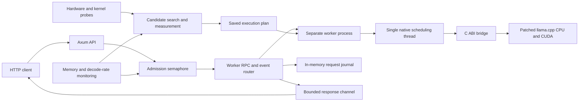

Flux architecture and implementation audit — 2026-10-04

This report records the original audited revision. The subsequent implementation fixes and current verification results are in [remediation.md](remediation.md).

Flux has a useful foundation for fast local inference: measured placement, a separate native worker, continuous batching, prompt reuse, expert residency, and speculative decoding. The current implementation nevertheless has reproducible availability and output-integrity defects. Resolve those before treating its performance or reliability as production guarantees.

This audit identifies **12 findings: 8 high priority and 4 medium priority**. “High” means a supported path can lose output, stop making progress, or violate the selected workload contract. “Medium” means a conditional performance, measurement, or reproducibility defect. These are engineering priorities, not security severity scores.

Review target: `f18ac23e9636bd5a774587e13415932a9b02b8c9`, including the existing patched llama.cpp working tree. The review followed serving, worker IPC, native scheduling, selected C++ bridge/backend paths, planning, plan persistence, and benchmark verification. It was not an exhaustive review of every backend kernel or ingestion format. No production implementation was changed; this directory contains the report and isolated reproductions.

The existing release workspace suite passed **101 tests**. The additional [historical reproduction program](repro/src/historical.rs) confirmed **12 defect scenarios** using production Rust functions and a protocol fixture, plus a journal-copy microbenchmark. This is distinct from model-backed integration testing. Although NVML reported an RTX 2060 and RTX 3060, the native test process reported `failed to initialize CUDA: no CUDA-capable device is detected`. No GPU TPS, model-quality, multi-GPU, or long-duration soak result is claimed here.

**Architecture and its performance consequences**



The HTTP/native process boundary contains native crashes. It does not itself provide availability: the supervisor must detect failure and replace the worker on every relevant request path. Token credit limits generation running ahead of readers, but it does not impose a deadline on a reader that remains connected without consuming. The journal resides in supervisor memory and survives a worker restart, not a supervisor restart.

The worker batches decode rows and one prompt chunk into each step. The single thread also handles tokenization, templates, stats, sampling, and reply parsing. Consequently, control work, long prompt steps, and CPU parsing directly compete with decode scheduling. Expert-cache staging, CPU/GPU overlap, and MTP introduce additional state that must be tested together with cancellation, rollback, and slot reuse.

**1. HIGH — Cancelled admission futures permanently consume queue accounting**

Evidence: `crates/flux-serve/src/admission.rs:44–50`. `waiting` is incremented before `acquire_owned().await` and decremented only after that await completes. Dropping the future skips the decrement. The semaphore waiter is cancelled, but Flux's separate counter remains incremented.

Reproduction: occupy the only sequence, poll another admission into the queue, then drop it. `waiting()` remains 1. With a queue depth of 1, another request receives `QueueFull` despite there being no actual queued request. Repeating this pattern can exhaust the default queue accounting. Requests may still enter through the immediate free-slot path; it is queueing under load that remains disabled.

A separate reproduced case shows that a request already queued is admitted after `close("memory pressure")`: closure is only checked before waiting.

Fix: use an RAII queue reservation whose destructor decrements the count, check the admission state after acquiring a permit, and define whether closure rejects or drains existing waiters. Test cancellation at every await boundary and verify that queue depth returns to zero.

**2. HIGH — Idle worker death does not recover, and live-but-stalled workers have no serving deadline**

Evidence: `crates/flux-serve/src/openai.rs:254–262` and `279–283` perform template/tokenizer RPC before `run_tokens`. Recovery occurs inside `crates/flux-serve/src/generate.rs:146–160`, after generation has begun. `/health` at `crates/flux-serve/src/lib.rs:119–122` checks admission closure only. The background monitor checks host memory, not worker liveness.

Reproduction: build the real service state with the fixture worker, kill that worker while idle, and submit two chat requests. Both return HTTP 400, worker generation remains 0, and admission remains open. The dead backend is classified as an invalid chat request, and the health implementation would still report OK.

Separately, `Worker::spawn`, `load`, `call`, and `send` have unbounded awaits (`crates/flux-core/src/worker.rs:103`, `127`, `144`, `157`). Generation has no progress deadline (`generate.rs:80`). A fixture that ignores one tokenizer RPC leaves that call pending until the reproduction's outer timeout cancels it, even though the fixture can answer later RPCs. A stuck native kernel or pipe can hold every permit indefinitely; restarting only on EOF is insufficient. Slow response readers can also retain slots indefinitely at `generate.rs:94`.

Fix: make worker health and generation state supervisor-owned; ensure readiness before preprocessing as well as generation. Add configurable startup, RPC, prefill-progress, decode-progress, and downstream-write deadlines. On timeout, retire the affected generation, clear RPC routes, and restart with bounded backoff. Readiness should reflect worker state; liveness should remain independently observable. Avoid using a normal stats RPC as the sole watchdog when it shares the blocked scheduling thread.

**3. HIGH — Replanning can deadlock or leave serving permanently stopped**

Evidence: `crates/flux-serve/src/lib.rs:181–207` has no lock around the complete replan transaction. `Admission::drain` acquires permits individually (`admission.rs:77–81`). The supervisor's restart mutex only protects later worker replacement.

Reproduction: at concurrency 2, start two drains while both request permits are occupied. Release the requests. Each drain can acquire one permit and wait forever for its second permit. This is a deterministic interleaving, reproduced without timing-dependent task scheduling. It applies to concurrent `/flux/replan` calls or manual replanning overlapping automatic replanning.

A second reproduction cancels `replan_now` while its replanner is pending. Admission stays closed with reason `replanning`, the old worker is already stopped, and no restoration occurs. Recovery is ordinary code after an await, so cancellation skips it.

There is also a closure-ownership conflict: memory monitoring calls `open()` when pressure clears (`monitor.rs:65–68`), even during a replan, and replan completion calls `open()` even if memory pressure persists. A single mutable reason cannot represent independent closure owners.

Fix: serialize the entire replan transaction in a supervisor-owned task, so an HTTP caller disconnect cannot cancel recovery. Acquire all drain permits atomically after establishing the exclusive replan state. Represent memory pressure, replanning, startup, and shutdown as independent admission blockers. Reopen only after a ready worker exists and every blocker is clear; surface restoration failure.

**4. HIGH — Worker replay and stream resume do not preserve the complete output state**

Evidence: `generate.rs:67–73` appends committed token IDs to a new prompt and restores the parser from delivered text. The new sequence creates a fresh `TextStream` (`crates/flux-worker/src/native.rs:328–330`). That stream retains incomplete UTF-8 and partial stop strings internally (`text.rs:10–13`). Neither buffer is transferred during replay.

Reproductions using the actual `TextStream`:

- With stop string `</end>`, the token bytes `hello </` emit only `hello `. After restart, the next bytes `end>` are emitted as text instead of completing the stop condition.
- A token ending with byte `E2`, followed after restart by bytes `82 AC`, yields replacement characters instead of `€`.

Separately, `generate.rs:107–110` sends `Finished.tail` to the original response but never stores it in the journal. The real completion handler with a fixture response returned `hello </`, while its journal retained only `hello `. Resume also stores no parsed tool/reasoning deltas. Reconstructing a sampler from the same seed is not equivalent to restoring its RNG position; the current replay does not promise identical stochastic continuation.

Fix: define one versioned output event log covering text, parsed deltas, terminal state, and a stable resume cursor. Either checkpoint detokenization/parser/sampler state or reconstruct it by replaying committed raw tokens through the same pipeline while suppressing already delivered events. Keep terminal stop/EOG state so a crash just before `Finished` does not resume beyond a completed response. Add kill-point tests around every token and terminal event, including byte-split Unicode and tool-call IDs.

**5. HIGH — Saved-plan reuse can violate requested context and optimization settings**

Evidence: `ProfileKey` contains a power-of-two context bucket, concurrency, and identities, but no workload objective (`crates/flux-core/src/plan.rs:12–21`). Actual planning rounds context only to 256 tokens (`crates/flux-plan/src/planner.rs:277`). CLI lookup compares only the key (`crates/flux-cli/src/planning.rs:129–140`) and returns before constructing the requested objective or engine constraints (`main.rs:228–253`).

Reproduction: save a 3072-token plan under bucket 4096, then perform the key lookup for a 4096-token request. It returns the 3072-token plan. Requests fitting the requested context can subsequently be rejected or have a smaller output ceiling. An interactive plan can likewise be reused for a serving objective; KV types and permitted engines are other settings absent from this lookup contract.

Fix: separate artifact/hardware identity from a complete workload-and-policy signature. Include exact effective context, objective and latency target, relevant runtime semantics, and allowed engines, or validate all these constraints explicitly before reuse. If buckets intentionally share plans, allocate for the bucket and verify that the cached plan satisfies the request. Test both directions of context changes and changes between interactive and serving objectives.

**6. HIGH — Planner validation and serving latency limits fail open**

Evidence: held-out failures set a candidate failure string (`planner.rs:883`), but if every validation fails, final selection falls back to `ranked[0]` (`planner.rs:892`) and returns a normal plan. Likewise, if all measured long-prompt contenders fail, the short-prompt ranking survives (`planner.rs:868–874`). These paths are proved by control flow; no model-backed failure injection was run.

Serving selection gives an SLO-violating candidate a negative score (`planner.rs:654–659`) rather than excluding it. If every candidate violates `max_p95_token_ms`, one still wins, and the recorded explanation says it is within the latency bound (`planner.rs:919`). Thus a successful plan result does not establish its stated serving contract.

Fix: require at least one candidate passing held-out execution and every hard constraint. Distinguish “best effort, constraints unmet” from a validated plan in both the type/schema and CLI. Do not claim long-context readiness when all attempted depth runs failed. Validate completion count, terminal reason, errors, memory envelope, and p95/p99 latency before ranking successful candidates by TPS.

**7. HIGH — Control traffic can starve native inference**

Evidence: `NativeWorker::run` calls `step()` only when `try_recv()` finds no queued request (`crates/flux-worker/src/native.rs:109–131`). Any available command takes the `handle` branch instead. The stdin command channel is unbounded (`crates/flux-worker/src/main.rs:100`). `/flux/tokenize` and `/flux/stats` bypass generation admission (`crates/flux-serve/src/lib.rs:136–151`), and tokenization runs synchronously on the scheduling thread.

When control requests arrive at least as fast as they are handled, the queue never empties and ready decode sequences make no progress. A generation-only concurrency limit cannot prevent this. This is a source-level scheduling proof, not a measured production TPS loss.

Fix: process a bounded number or time budget of control commands, then service ready inference work. Bound control queues and limit expensive tokenizer/template requests separately. Keep cancellation and shutdown responsive. Report queue lengths, scheduling delay, and the longest interval without a decode step. Test an ongoing generation under sustained stats and large-tokenization traffic and require measurable forward progress.

**8. MEDIUM — Journal replay performs quadratic copying under a global mutex**

Evidence: `Journal::get` clones the entire entry, including prompt and every text string, while holding one journal-wide mutex (`crates/flux-serve/src/journal.rs:77–78`). `resume()` calls it once for each emitted event (`openai.rs:331–334`). Replaying N tokens therefore copies O(N² + N·prompt_length) data and makes that allocation work contend with every request's journal writes.

A release microbenchmark invoking the actual `get()` N times on N-token entries with a 1024-token prompt measured:

| Retained output tokens | Replay clone time |
|---:|---:|
| 1,000 | 22.1 ms |
| 2,000 | 88.1 ms |
| 4,000 | 523.6 ms |

These are local clone-loop measurements, not end-to-end HTTP or GPU timings. The scaling follows directly from the implementation; absolute timings depend on allocator and host load.

Retention has no byte or entry cap. TTL cleanup only runs on the next `begin()` (`journal.rs:47–55`); the reproduction verified that completed entries remain readable after TTL until another request begins. Cleanup scans the whole map under the same lock on every new request. Large retained prompts and multiple resume readers can undermine the memory admission mechanism itself.

Fix: provide an indexed event/range read that clones only requested events; do not copy prompts during replay. Use per-request state or immutable chunks, byte-budgeted retention, and periodic expiry. Keep terminal events subject to the same retention policy and make expiration explicit to clients.

**9. HIGH — External chat loses tool calls and never completes journal entries**

Evidence: the external-chat path calls `journal.begin` (`openai.rs:238`) but `run_chat` never pushes or finishes the entry (`generate.rs:179–220`). Non-streaming response assembly concatenates only `delta.content` and falls back to a plain assistant message (`openai.rs:177–188`), discarding tool calls and reasoning fields.

Reproduction: a fixture chat worker emits a tool call and finishes successfully. The real non-streaming HTTP handler returns no `tool_calls`, reports `finish_reason: "stop"`, and leaves the journal entry `Running`. Such entries are exempt from TTL expiry, so sustained external-chat use accumulates them indefinitely.

The adapter additionally counts SSE payloads as decoded tokens (`crates/flux-worker/src/external.rs:310–324`); chunks can contain zero, one, or multiple tokens. Token-level planner calibration always starts with template/tokenizer RPCs (`planner.rs:1489–1500`), which the chat-only adapter rejects. The declared generic-engine support therefore needs a separate capability-aware measurement path.

Fix: implement a shared chat accumulator preserving content, reasoning, tool-call indexes/IDs/arguments, actual finish reason, and usage. Close journal entries on every outcome, or explicitly disable journaling/resume for unsupported engines without allocating entries. Measure chat-only engines through their supported API and label metrics according to what is actually measured.

**10. MEDIUM — Throughput and soak verification can accept incomplete or miscounted output**

Evidence: `crates/flux-bench/src/client.rs:81–105` treats a clean HTTP EOF as success without requiring a terminal finish marker or the requested output count. Its chat token count is one per content/reasoning chunk (`client.rs:58–65`), not tokenizer output or reported completion usage. The soak client also returns `Completed` after EOF without a finish assertion (`soak.rs:95–120`). Its corruption check compares only journal token count with streamed chunk count (`soak.rs:156–159`), not text or token identities.

A cleanly truncated stream with several chunks can consequently contribute a throughput measurement as a successful stream. Equal counts cannot detect substituted, reordered, or corrupted text. A final tail chunk can also be counted as a token by the Flux benchmark path. These are source-proven verification gaps; this audit did not run a live HTTP truncation fixture.

Fix: require a valid protocol terminal event and consistent usage; when benchmarking fixed-length `ignore_eos` runs, require the exact token count. Distinguish token throughput from chunk throughput. Compare output event sequence, reconstructed bytes, and finish reason in soak tests, with special cases for intended cancellation and replay. Add abrupt and clean truncation fixtures so missing completion cannot look faster.

**11. MEDIUM — Drift detection confuses consumer speed and concurrency with engine regression**

Evidence: `generate.rs:55–58` calculates decode TPS from event-receive timestamps, while `generate.rs:94` awaits the bounded client-response channel. Once a reader applies backpressure, subsequent timestamps measure the reader's consumption pace. `monitor.rs:80–106` compares that rate with an uncongested validation baseline and may trigger a replan. It adjusts for prompt depth and agent traffic, but not active sequence count, overlapping prefills, pauses for credit, or worker recovery.

Thus a slow reader or a different concurrency mix can supply five low observations without any backend regression. Automatic replanning is disabled by default (`retune_horizon_tokens = 0`); the outage risk applies when enabled, while drift reporting can still be misleading.

Fix: record engine step time, credit-starvation time, output-write time, prefill overlap, active sequence count, and replay time independently. Compare like workload classes and exclude consumer-limited or recovered requests from backend-drift decisions. Require a cooldown and an estimated improvement beyond measurement noise before draining service for retuning.

**12. MEDIUM — Backend build identity does not identify the running implementation completely**

Evidence: `crates/flux-native/build.rs:49–61` builds `FLUX_BACKEND_BUILD` from the pinned revision and patch-file bytes. It does not hash the C++ bridge, compiler/CMake configuration, compiled libraries, or extra submodule edits. The check at lines 17–22 validates HEAD and library existence, not that those libraries correspond to those patches. Changing CPU ISA, CUDA graph settings, bridge behavior, or applying an additional local backend edit can retain the same plan identity.

This is a provenance gap with a concrete stale-cache consequence, not a claim that the installed libraries are currently mismatched.

Fix: emit a backend build manifest containing source-tree/patch digest, bridge digest, compiler versions, relevant CMake flags, target architectures, and library build IDs. Have the running worker report that identity and compare it with the plan before loading. Version planner policy separately so changes to plan semantics can invalidate old decisions intentionally.

**Performance improvements to measure after the correctness fixes**

These recommendations follow the observed implementation. Their TPS benefit is unmeasured and depends on model, hardware, context, concurrency, and traffic shape.

| Change | Implementation evidence and intended benefit | Measurement needed |
|---|---|---|
| Give prefills a latency-aware time budget and fair rotation | `native.rs:359–377` fills the remaining batch with the first incomplete prompt. Long prefills share steps with decode and later prompts wait behind the first. Bound decode interference and short-prompt TTFT. | Mixed long/short arrivals; p95/p99 TTFT and inter-token latency, aggregate TPS. Sweep chunk size under load. |
| Enforce a total decode/draft batch budget | `native.rs:341–357` appends each sequence's draft before checking remaining batch space. The bridge rejects `n > n_batch` at `flux_native.cpp:1221–1223`. Prevent configuration-dependent batch rejection when active decode plus drafts exceed capacity. | Exercise the boundary `sum(1 + draft_length) <= n_batch`; include smaller manually supplied plans and high concurrency. |
| Batch drafting across active sequences | `native.rs:349` invokes drafting separately per sequence, despite the underlying speculative API accepting per-sequence parameters. Reduce repeated draft launches and synchronization where supported. | Compare accepted tokens per target step and total draft+verify+rollback time at concurrency 1, 2, 4, and 8. Preserve output quality. |
| Reuse hot-loop allocations and avoid copying full histories unnecessarily | `native.rs:337`, `425` allocate step vectors; `flux_native.cpp:1494` copies the entire history per drafting call; `token_bytes` allocates a buffer per token. | CPU profiles and allocator counts for long-context, high-TPS models; only optimize material costs. |
| Measure and budget recurrent checkpoints | `flux_native.cpp:1421–1443` stores up to four host snapshots per slot; `native.rs:410–414` captures them synchronously. Their cost depends on model state and concurrency. | Bytes per snapshot, capture/restore stall, total host peak, reuse hit rate, and avoided prefill time. Compare checkpoint policies. |
| Separate first-load, cold-prefix, and warm-prefix performance | Native idle slots retain prefixes, while the comparison path explicitly uses `cache_prompt: false` for llama-server. Expert pinning is awaited during native load (`flux_native.cpp:957–959`). | Publish cold and warm regimes separately; align reuse policy when comparing schedulers. Include load/pinning time in readiness measurements. |
| Strengthen quality certification | `planner.rs:1348–1351` allows the first divergent token when it is the reference runner-up; it does not establish arbitrary later correctness or test every rollback position. | Teacher-forced logits/output checks across placements, cache changes, draft lengths, concurrent sequences, recurrent reuse, and injected host-expert failures. |

Keep the process boundary, measured placement, and token credit. First make their state transitions explicit and observable. A transport rewrite or a new batching architecture is premature without profiles showing where time is spent.

**Implementation order and acceptance criteria**

1. **Restore progress guarantees.** Fix findings 1–3 and 7; add a supervisor state machine, cancellation-safe admission, serialized replanning, bounded control work, and deadlines. Acceptance: queued cancellations restore accounting; concurrent replans complete; idle crashes recover; stalled workers fail within a configured bound; readiness never reports a dead worker as ready.
2. **Make outputs and plan contracts trustworthy.** Fix findings 4–6 and 9. Acceptance: byte-exact resumed output and terminal state at injected failure boundaries; preserved external tool calls; no journal entry left running after completion; plan reuse satisfies every requested constraint; failed validation produces no validated plan.
3. **Repair measurement and retention.** Fix findings 8 and 10–12. Acceptance: linear replay scaling, bounded journal bytes, completion-aware benchmark results, workload-aware drift, and matching plan/worker build manifests.
4. **Tune TPS against a defined service envelope.** Run paired trials on a dedicated, CUDA-capable host and apply the performance experiments above only where profiles justify them.

For the fourth stage, record model/tokenizer hashes, backend build identity, device free memory, CPU affinity, thermal/clock state, context and output lengths, cache state, concurrency, and offered request rate. Test dense and MoE models, an attention-only model and a recurrent/hybrid model, one and multiple GPUs, speculation on/off, cold/warm prefix reuse, and memory-limited configurations actually supported by the deployment.

Use both fixed-concurrency trials and open-loop arrivals. Report per-stream decode TPS, aggregate **successfully completed** output tokens/s, TTFT, p50/p95/p99 inter-token latency, end-to-end latency, rejection rate, goodput within the SLO, peak host/device memory, and worker restart time. Do not optimize a single TPS number while excluding failures or hiding queueing.

Fault coverage should include idle and active worker death, worker stall, slow and disconnected readers, cancelled queued requests, simultaneous replans, replanner failure, failed rollback load, memory-pressure recovery during replan, malformed/truncated worker events, cleanly truncated HTTP streams, Unicode/stop boundaries, and recurrent/speculative slot reuse. Run long enough to observe retention expiry and repeated recovery, not only warm steady-state generation.

No architectural review can guarantee an absolute TPS or zero failures. A defensible release claim requires the corrected invariants plus passing measurements for the stated model/hardware/workload envelope. On the current evidence, Flux is **not ready for an unconditional robustness or serving-SLO guarantee**, even though its existing unit suite passes.

**Run the regression suite**

From the repository root:

```sh
cargo test --release --workspace -- --test-threads=2
cargo run --release --offline --locked \
  --manifest-path audits/2026-10-04/repro/Cargo.toml \
  --target-dir target
```

The runner now invokes the maintained workspace regression tests. The original defect assertions remain in `repro/src/historical.rs` for reference and are not compiled. Lifecycle tests use a protocol fixture, temporary directories, and no real model; the truncation fixture uses localhost HTTP. These checks establish Rust lifecycle behavior, not native GPU performance. Offline execution requires dependencies already present locally.

Files: [regression runner](repro/src/main.rs), [historical reproduction](repro/src/historical.rs), [historical protocol fixture](repro/mock-worker.py), and [original validation record](validation.md).
