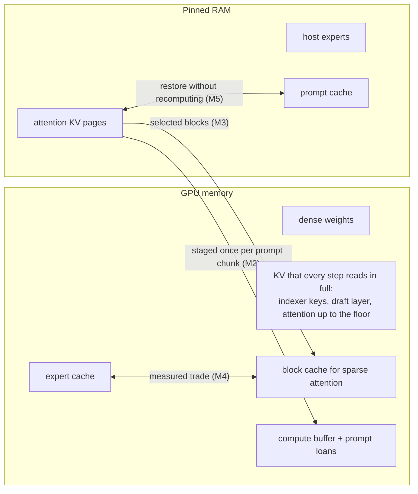
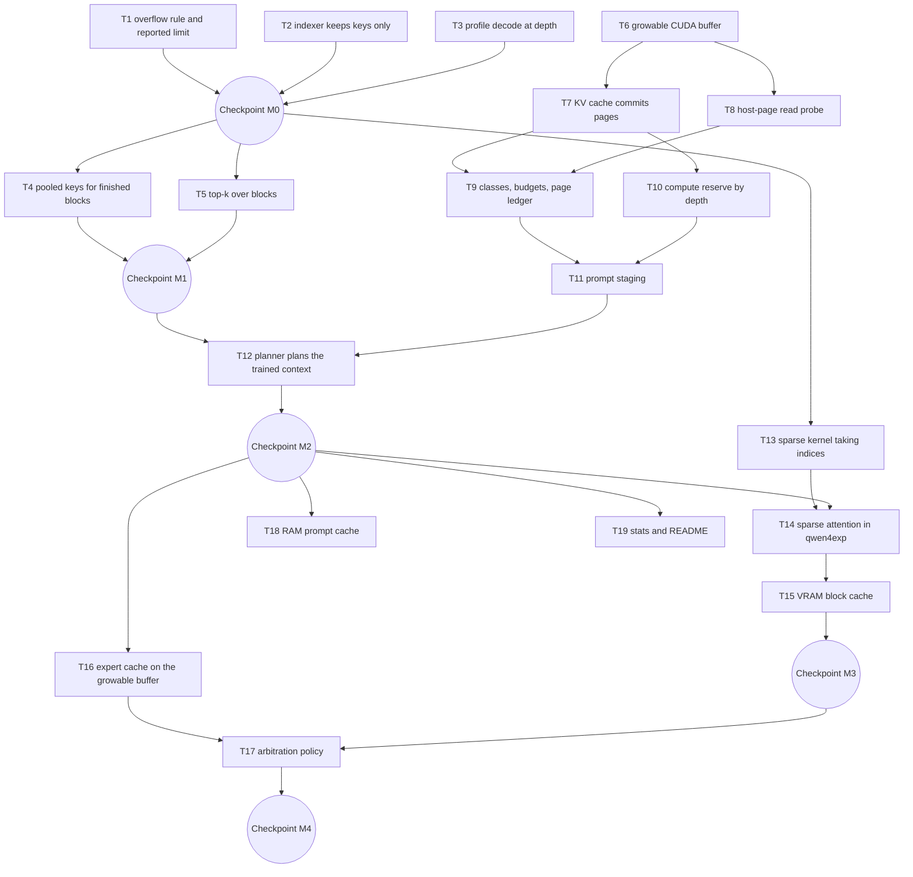

# Variable context: each model's trained context, in VRAM and RAM

Status: trained context served (262,144 tokens on Flash-Next); VRAM arbitration deferred (2026-10-05). Owner: Flux backend.

Implementation checkpoints (these do not replace the acceptance criteria below):

- T1: done: overflow rule, reply floor and `/v1/models` context. Qwen Code verification remains.
- T2: done: the indexer cache keeps keys only. With pooled keys on, its pages past the floor may live in RAM, since decode reads raw keys only for unfinished blocks.
- T3: done for the target: per-op tables at 19K and 57K in [variable-context-baseline.md](variable-context-baseline.md).
- T4: done and enabled: identical greedy output to masked at 19K and 57K on one build; CUDA0 indexer work at 57K falls from 6.99 to 0.49 ms per graph.
- T5: done and enabled after a fix: block selection never ran on M-RoPE models. It removes 6.3 ms per graph of cell expansion at 57K. It keeps the boundary block's lowest cells where the radix top-k keeps arbitrary ones. Its top-k is launch-bound (about 70 µs per call), not r times faster.
- Run-to-run divergence: the second GPU's expert tier reruns late jobs on the CPU, which rounds differently. `FLUX_MOE_TIER_WAIT=1` makes outputs repeat for comparisons.
- T6, T8: done.
- T7: done: paged with the floor at full capacity decodes the same 512 tokens as unpaged at 57K; RAM pages decode the same tokens as VRAM pages.
- T9: done: ledger, admission and decode-ahead reservation; the ledger reads available RAM only when a page needs it. The shortage tests through `flux serve` remain.
- T10: the decode graph is reserved at full depth and prompt chunks at the floor. The chunk table is measured from the reserve's own graphs. Past the floor, the indexer scores tokens in slices. A loaned chunk that misses its region retries with the whole region.
- T11: done: staging and in-place reads give identical output; a timed trial picks one per deep batch (staging won at 100K: 8.6 against 12.0 ms per token).
- T12: done: `flux plan` defaults to the trained context, budgets KV pages per GPU, caps the context by RAM and skips engines that allocate the whole cache. Flash-Next plans at 262,144 tokens.
- T13: done.
- T14: done for decode, which uses indexed attention whenever eligible: at 57K with KV in RAM, attention falls from 11.7 to 1.85 ms per graph. Prompt chunks stay masked: indexed prefill took 471 s at 57K against 183 s.
- Long prompts: 131,000 and 200,000-token prompts complete with coherent output. Prompt chunks borrow each GPU's unused KV page budget, which brought the 131K prompt from 991 to 758 s. Through `flux serve`, a 140K prompt, its next turn (10 s, prefix reused), the overflow error and a RAM-shortage rejection all behave as specified ([variable-context-baseline.md](variable-context-baseline.md)).
- 262K plan `2c6a68321746044d`: 40.3 tok/s decode on short prompts. A 65K plan on the same backend decodes at 39.5 to 43.0 tok/s, so the 262K reservations cost at most 6%, and T16/T17 are not worth their complexity now. A Qwen Code session through `flux serve` reached about 130K tokens without errors.
- Open: short-prompt decode on both plans is below the 50.4 tok/s of plan `6a8bd99efd67d8b0` (2026-10-04). That plan predates commits `1950b09` and `2eab2eb`, which were never measured on the GPU, and the probe now picks 12 decode threads instead of 6. A 6-against-12-thread A/B was within run-to-run noise. Finding the cause needs a 65K plan on the `f18ac23` backend. Also open: T15, T18, and planning on GPUs that cannot read host pages (the default context then stops at the floor).

Flux will serve every model at its own trained context. The KV cache grows with the conversation: its pages live in VRAM while the GPU has room and in pinned RAM after that. Short conversations keep today's speed, long ones run instead of failing, idle RAM does work, and a request that cannot fit fails at admission with the error clients already handle. Every size and placement comes from the model's GGUF or from a measurement; nothing depends on one model or one machine.

## Why

A Qwen Code session on Flash-Next looped until it failed. Two rules combined:

- `flux plan` caps the context at `DEFAULT_CTX = 65536` (`crates/flux-cli/src/main.rs:224`), while Flash-Next is trained for 262,144 tokens.
- `flux serve` rejects a request only when the prompt leaves no token at all (`crates/flux-serve/src/openai.rs:128`). At 65,519 prompt tokens it trimmed `max_tokens` to the 17 tokens left, the model spent them on reasoning, and Qwen Code retried the same 17-token turn.

Qwen Code assumes 200,000 tokens for models it does not know and compresses its history near that limit or after an overflow error. At 65,536 tokens it reached neither.

Raising the cap alone does not work, because the KV cache is allocated in full at load:

| Memory on the RTX 3060 (plan 6a8bd99efd67d8b0) | 65,536 tokens | 262,144 tokens |
|---|---|---|
| Attention KV, 12 layers, f16 | 1.5 GiB | 6.0 GiB |
| Indexer keys (Flash-Next's sparse attention) | 0.19 GiB | 0.75 GiB |
| Indexer V, allocated but never read | 0.38 GiB | 1.5 GiB |
| Draft (MTP) layer KV | 0.13 GiB | 0.5 GiB |
| Recurrent state, 36 linear-attention layers | 0.66 GiB | 0.66 GiB |
| Compute buffer, reserved for the full depth | 1.07 GiB | several GiB |
| Expert cache | about 3 GiB | none left |

Meanwhile about 45-50 GB of RAM sits idle while Flux serves. Flux pins 33-41 GB of host experts, which system monitors show as cache.

Long conversations are also slow. Decode falls from 50.4 tok/s on short prompts to 24.7 tok/s at 57K tokens. Every decode step gathers every cell's indexer key, pools, normalizes and rotates every block, sorts a score for every cell, and runs attention over all cells behind a mask (`build_qsa_top_k` in `src/models/qwen4exp.cpp`).

## Goals

- Serve each model's trained context, read from its GGUF, unless VRAM plus the RAM budget cannot hold it; then serve the largest context that fits and say so.
- Keep or raise TPS at the depths people use today. On Flash-Next: decode 50.4 tok/s on WikiText and 24.7 tok/s at 57K tokens; prefill 527 tok/s at 19K and 429 tok/s at 57K.
- Fail only at admission. A request that cannot fit gets the standard overflow error; no step fails because memory ran out.
- Work for every attention type llama.cpp supports: dense, sliding-window, linear and sparse (indexer).
- Decide placements by measurement, per GPU, with host link rates measured under decode load.

## Non-goals

- Running a model past its trained context by rescaling its position encoding.
- Making dense-attention models fast once their KV cache lives in RAM. They read the whole context on every token, so PCIe and RAM bandwidth set their speed.

## Decisions

| Question | Decision | Why |
|---|---|---|
| KV precision | f16 by default. The planner also measures q8_0 and keeps it only when it passes the KL quality check and is faster at the planned depths, prompt chunks included. | q8_0 stores 53% of f16's bytes, which pays mainly when it keeps the cache in VRAM. Its prefill path converts K and V back to f16 on every layer call (`fattn-common.cuh`), so prompt chunks pay memory and time that grow with depth. |
| Host memory reserve | One reserve, 10% of total RAM, replaces `host_reserve_mib` and `min_available_mib`. The planner, the serve-time RAM budget and admission all use it. | One number cannot disagree with itself; 10% leaves the desktop room without guessing its needs. |
| Reply room | A request fails with `context_length_exceeded` when the prompt leaves fewer than `min(max_tokens, min_reply)` tokens. `min_reply` defaults to 4,096. | `max_tokens` stays a ceiling, since agents ask for 32K-64K on every turn. The floor stops turns that can only produce a few tokens of reasoning. |
| Concurrent conversations | Paged from M2 on, through the per-stream regions. Each stream's capacity is the trained context, and address space is reserved for every stream. | One code path for every concurrency. The KV tensors already split per stream, and address space costs no physical memory. |
| Flash attention | Growable KV requires flash attention; without it, the cache is allocated up front. | Without flash attention V is stored transposed (`v_trans = !flash_attn` in `src/llama-model.cpp`), so each row spans every cell and any prefix of cells touches every page. |
| VRAM split before arbitration | Attention KV keeps VRAM for a floor of 65,536 tokens (`plan.kv_floor_tokens`); the expert cache gets the rest. M4 replaces the floor with a measured trade. | Keeps today's speed at today's depths. At 57K tokens masked attention reads 1.4 GB of KV per decode step; from RAM that adds about 80 ms to every step. |

## Design

### D1. A growable buffer on CUDA virtual memory

The CUDA backend gets a buffer type that reserves address space for a whole capacity and maps 2 MiB physical pages on request, each in VRAM (`CU_MEM_LOCATION_TYPE_DEVICE`) or in pinned RAM (`CU_MEM_LOCATION_TYPE_HOST_NUMA`). Kernels see one contiguous range, so attention, `set_rows` and copies need no changes, and captured CUDA graphs stay valid because addresses never move. A page moves in place: copy out, unmap, map the new page, copy back.

A probe on this machine (CUDA 12.4, driver 575) showed a kernel reading one range, half in VRAM and half in RAM, correctly, and a page moving without losing data. It measured these read rates on an idle bus:

| GPU | Kernel reads, VRAM pages | Kernel reads, RAM pages |
|---|---|---|
| RTX 3060, PCIe 4.0 x16 | 296 GB/s | 22.7 GB/s |
| RTX 2060, PCIe 3.0 x4 (chipset) | 267 GB/s | 2.9 GB/s |

The RAM rates do not hold during decode. The CPU's expert misses already pull about as much as this machine's RAM delivers (17-19 GB/s measured), and a GPU reading KV pages competes for the same bandwidth. Placement therefore uses rates measured under load (T8).

Two layout rules keep pages independent:

- The buffer type reports 2 MiB alignment, so every tensor starts on a page. The KV cache packs all layers of a device into one buffer (`ggml_backend_alloc_ctx_tensors_from_buft`); without the alignment, releasing one tensor's tail would unmap the next tensor's head.
- Every stream's slice of every tensor is a whole number of pages. The allocation pads each slice to whole pages; the context stays the trained context.

Backends without virtual memory allocate the capacity up front, or the largest capacity that fits. CPU buffers grow for free, because Linux backs untouched pages lazily; the cache must not clear whole buffers, which touches every page, and it returns released ranges with `madvise(MADV_DONTNEED)`.

### D2. The KV cache commits pages ahead of each step

A graph reads cells `[0, n_kv)` of each stream, where `n_kv` is the highest used cell padded to 256 (`llama_kv_cache::get_n_kv`). With flash attention, those cells form a prefix of each tensor's stream slice, and that prefix is what must be committed. Every cache instance uses the same mechanism: the attention cache, the indexer cache (`llama_memory_hybrid_idx`), the draft layer's cache, and the caches of other architectures. Size-only reserves (`init_full`, `reserve_n_kv`) commit nothing.

A page ledger in the worker makes every commit, always outside a step:

- **Admission.** The ledger commits the prompt plus `min_reply` cells for the request's stream. If VRAM and the RAM budget together cannot hold them, the request fails with `context_length_exceeded`, naming the context that fits now.
- **Decode.** The ledger commits ahead in chunks of pages while the GPU runs the previous step. A VRAM shortfall sends the page to RAM; a RAM shortfall ends the reply with `finish_reason: "length"`, after at least `min_reply` tokens.
- **Release.** After `seq_rm` and `clear`, the ledger releases pages past the used cells, with slack, so a conversation that shrinks and grows again does not remap pages on every request.

Code that touches the whole buffer must change before any page goes uncommitted:

| Access | Where | Handling |
|---|---|---|
| Clear at construction | `llama_kv_cache` constructor | Skip; the buffer starts uncommitted |
| Full clear | `llama_kv_cache::clear(true)` | Clear committed pages only |
| K-shift graph | `llama_kv_cache::build_graph_shift` views every cell | Limit to committed cells; Flux calls neither `seq_add` nor `seq_div`, so this path stays idle |
| Stream copy | `llama_kv_cache::update` copies whole streams after `seq_cp` | Copy the committed prefix only; Flux never calls `seq_cp` |
| State read | `llama_kv_cache::state_read_data` | Commit the target cells first |
| Size reports | `llama_memory_breakdown_data`, the dry run `fx_measure` | Report committed bytes and capacity separately |

### D3. Placement by class, then by budget

The way a step reads a cache decides where its pages may live:

| Class | A step reads | Examples | Pages live in |
|---|---|---|---|
| Full-read | every cell | indexer keys; the draft layer, which attends to every cell even on Flash-Next; sliding-window caches | VRAM only |
| Dense attention | every cell | Qwen3.6's attention; Flash-Next's attention before M3 | VRAM up to the floor, then the VRAM budget, then RAM where the measured rate allows |
| Sparse attention | the selected blocks | Flash-Next's attention from M3 on | RAM, behind the VRAM block cache (D7) |

Three budgets bound the classes:

- **VRAM**, per GPU: what the plan measured as free after weights, expert cache and compute, refitted at start like `planning::fit`. The planner reserves the full-read classes at full capacity before it sizes the expert cache (0.75 GiB of indexer keys and 0.5 GiB of draft-layer KV at 262K tokens on Flash-Next), so admission never rejects a request below the advertised context.
- **RAM**: `MemAvailable` when `flux serve` starts, minus the host weights the plan will pin (`plan.host.resident_weights`), minus the reserve. The worker reads it before loading, so the experts it is about to pin must come off.
- **Link**: each GPU's host-page read rate from the probe report, measured while CPU threads stream weights (T8). A GPU whose rate cannot sustain the planned decode gets no RAM pages; the planner moves its attention layers to a faster GPU, or caps the context.

### D4. Compute buffers follow the depth in use

`sched_reserve` reserves the worst-case graph over the whole capacity (`memory->init_full()`); at 262K tokens that holds several GiB of VRAM before anyone uses it. The reserve splits in two:

- **Decode** graphs are reserved at full capacity when the plan loads. Decode must never fail, and this reserve means the allocator never grows mid-conversation.
- **Prompt chunks** follow the measured chunk table. Deeper chunks shrink, or borrow through prompt loans, which already lend expert-cache memory to the compute buffer and the scratch pool (commit f18ac23). The table includes the scratch pool and, for q8_0, the f16 copies that flash attention makes of K and V.

### D5. The indexer reads less

Flash-Next's indexer scores blocks of r cells (r = 4) and keeps the top 2,048 cells for each query. Three changes cut its cost without changing which cells it keeps:

1. **Keys only.** `llama_kv_cache` allocates a V tensor unless the model uses MLA. The indexer cache never reads V: that is 384 MiB at 64K tokens and 1.5 GiB at 262K, all of which the expert cache can use.
2. **Pooled keys for finished blocks.** A block's pooled, normalized and rotated key depends only on its cells and its position, so the cache stores that key once the block fills. Each step then reads one key per block, instead of r raw keys plus the pooling, normalization and rotation of the whole history. Only the tail block is computed live, and removing cells from a block drops its pooled key.
3. **Top-k over blocks.** Every cell of a block shares the block's score, and the budget is whole blocks. Choosing the top 2,048 / r blocks and expanding them to cells keeps the same cells with an r-times smaller sort.

The gain depends on the indexer's share of a decode step at depth, which T3 measures first.

### D6. Sparse attention reads only the selected cells

Flash-Next runs flash attention over every cell, with a mask that hides all but the selected ones (`TODO: enable sparse attention` in `qwen4exp.cpp`). Upstream's sparse path (`ggml_flash_attn_ext_set_n_kv_max`) reads only the selected cells, with three limits:

- It supports head sizes 512/512 and 576/512 only (DeepSeek); Flash-Next uses 256.
- It rebuilds the cell list from the mask, so the graph still builds a cells-by-tokens mask per layer (fill, `set_rows`, add), and those masks cap prompt chunks at depth.
- It runs one query per tile and needs at least max(4096, 2 × top-k) cells, so on prompt chunks it trades tile reuse for fewer cells.

Flux's kernel takes the indexer's cell indices directly, supports head size 256 first, and drops the masks wherever it runs. Decode uses it whenever it is eligible; prompt chunks use it at the depths where the planner measured it faster. The draft layer keeps dense attention and stays in the full-read class.

### D7. A VRAM block cache in front of RAM pages

With sparse attention, a step reads 2,048 cells per query per layer. Those cells sit in blocks of r spread across the whole history, so nearly every 2 MiB page (2,048 cells of one tensor at 1 KiB per row) holds a selected cell on every step, and moving whole pages cannot separate hot cells from cold ones. Attention K/V therefore lives in RAM pages, and a fixed VRAM cache holds the blocks the indexer selects:

- Before attention, one gather copies the selected blocks missing from the cache into cache slots, for the union of the verify batch's queries. The sparse kernel then reads only VRAM.
- Eviction is CLOCK over blocks, and the planner measures the cache size. Strata uses the same structure, with 32,768 cells.
- The baseline to beat is reading selected cells straight from RAM pages. There each query of a verify batch reads its own set, so RAM traffic grows with the verify width.

### D8. Long prompts stage RAM pages once per chunk

Flash attention on a prompt chunk reads each K/V tile once per tile of queries, so KV pages in RAM would cross PCIe several times per chunk. When a layer has pages in RAM and the chunk would read them more than once, the graph first copies the layer's committed K/V into a VRAM staging tensor borrowed through prompt loans, and attention reads the copy. Each chunk then makes one PCIe pass per layer. Strata stages the same way.

### D9. VRAM moves between the expert cache and the KV cache

Once the expert cache's pools sit on the growable buffer, its pages can move to the KV cache and back. A measured policy compares what each page saves: decode time lost to RAM reads or block-cache misses, against expert-cache hits lost by giving up the page. Prompt loans borrow from the same pages. This policy replaces the fixed KV floor.

### D10. A prompt cache in RAM

Agents return to earlier prefixes: sub-tasks, retries, history compression, switching sessions. Flux keeps the KV of the last conversation per slot and recomputes everything else. A RAM cache keeps the KV pages and recurrent-state checkpoints of past conversations, keyed by token prefix and evicted least-recently-used within the RAM budget.

- Hybrid models resume only where a recurrent checkpoint exists, so a restore takes the longest cached prefix that ends at a stored checkpoint.
- Full pages from cell 0 map into the new stream read-only, without a copy. The partial last page is copied, because the new conversation writes into it.
- Restores never use `seq_cp` across streams, which copies whole streams.
- Build it only if serve logs show prompt reuse falling to the system prompt after agents' side requests; the per-slot checkpoints already cover ordinary turns.

### D11. Clients learn the limit

- `/v1/models` reports the context as `context_length`, `max_model_len` and `meta.n_ctx`, for clients that read it.
- Overflow errors use OpenAI's shape and message: HTTP 400, with `{"error": {"type": "invalid_request_error", "param": "messages", "code": "context_length_exceeded", "message": "This model's maximum context length is N tokens. However, your messages resulted in M tokens."}}`.
- Qwen Code 0.24.6 never reads `/v1/models`. It detects an overflow by scanning the error for strings such as `context_length_exceeded`, reads N and M from the phrasing above, and compresses once per request, sized by those numbers. Without them it falls back to its `contextWindowSize` setting or a 200,000-token default.

## Milestones

| Milestone | Outcome | Effort |
|---|---|---|
| M0 Quick wins | Clean overflow at the limit; 384 MiB more expert cache on Flash-Next; decode cost at depth profiled | 1 day |
| M1 Indexer | Faster decode at depth on indexer models, before any paging | 1-2 days |
| M2 Growable KV | Trained context for every model; memory grows with use; failures only at admission | 5-7 days |
| M3 Sparse attention | Indexer models fast at long depth, with attention KV in RAM behind a VRAM block cache | 3-5 days |
| M4 VRAM arbitration | Expert cache and KV cache trade pages by measured value | 2-3 days |
| M5 RAM prompt cache | Past conversations restored from RAM, if the logs show the need | 1-2 days |

## Tasks

Every patch change invalidates all plans (`FLUX_BACKEND_BUILD`), so each checkpoint ends with a replan and validates on Flash-Next (sparse plus linear attention) and Qwen3.6-35B-A3B (dense attention). Measurements run on an idle machine; runs over 30 minutes wait for the user's go-ahead.

### Phase 0: Quick wins (M0)

#### T1. Overflow rule and reported limit

A request fails when its prompt leaves fewer than `min(max_tokens, min_reply)` tokens, with OpenAI's error shape and message (D11), and `/v1/models` reports the context.

- Acceptance: a prompt 100 tokens short of a 16K plan's limit gets HTTP 400 with N and M in the message; a prompt with room keeps `max_tokens` as a ceiling; Qwen Code compresses once and continues.
- Verification: a Qwen Code session pushed past a plan made with `--ctx 16384`; requests to both endpoints.
- Depends on: none.
- Files: `crates/flux-serve/src/openai.rs`, `crates/flux-core/src/config.rs`.
- Size: S.

#### T2. The indexer cache keeps keys only

`llama_kv_cache` gains a keys-only mode, and the indexer cache uses it.

- Acceptance: the worker log shows the indexer cache with K only (192 MiB at 64K tokens); greedy output is identical on the 19K and 57K prompts; a replan caches more experts and decodes WikiText at 50.4 tok/s or more.
- Verification: worker log; A/B on both prompts; `flux plan` on Flash-Next.
- Depends on: none.
- Files: `src/llama-kv-cache.cpp`, `src/llama-kv-cache.h`, `src/llama-memory-hybrid-idx.cpp`.
- Size: S.

#### T3. Profile decode at depth

Break a Flash-Next decode step at 19K and 57K tokens into its parts: masked attention, the indexer's gather, pooling, normalization and rotation, top-k, the mask build, the draft layer, and the experts.

- Acceptance: a per-op table for both depths; it sets the expected gains of T4, T5 and T13 and the 57K decode targets.
- Verification: `FLUX_CUDA_OP_PROFILE=1` runs, each under 30 minutes.
- Depends on: none.
- Files: none.
- Size: S.

#### Checkpoint M0

- Replan Flash-Next; record decode on WikiText and at 19K and 57K tokens, and prefill at 19K and 57K.

### Phase 1: Indexer (M1)

#### T4. Pooled keys for finished blocks

The indexer cache stores each finished block's pooled, normalized and rotated key, and the graph reads those keys plus a live tail block (D5).

- Acceptance: greedy output identical at 19K and 57K; decode at 57K faster than Checkpoint M0, by about the share T3 gave to pooling, normalization and rotation; `seq_rm` into a block drops its key.
- Verification: A/B at 19K and 57K; the T3 profile repeated.
- Depends on: Checkpoint M0.
- Files: `src/models/qwen4exp.cpp`, `src/llama-memory-hybrid-idx.cpp`, `src/llama-memory-hybrid-idx.h`.
- Size: M.

#### T5. Top-k over blocks

Top-k picks blocks, then expands them to cells (D5).

- Acceptance: greedy output identical at 19K and 57K; top-k time per step falls about r times in the profile.
- Verification: A/B and profile as in T4.
- Depends on: Checkpoint M0.
- Files: `src/models/qwen4exp.cpp`.
- Size: S.

#### Checkpoint M1

- Replan Flash-Next; record decode at 19K and 57K tokens.
- Review with the user before Phase 2.

### Phase 2: Growable KV cache (M2)

#### T6. Growable CUDA buffer

The CUDA backend exposes a buffer type that reserves address space for a capacity and commits, releases or moves 2 MiB pages between VRAM and pinned RAM on request (D1).

- Acceptance: ordinary kernels read and write its tensors across VRAM and RAM pages; committing, releasing and moving pages keeps the data of committed pages; released pages return their memory (`nvidia-smi`, `free`); every tensor starts on a page; an unsupported device reports it, so callers fall back.
- Verification: `test-backend-ops` passes with KV tensors in the new buffer; the T8 probe exercises the buffer API.
- Depends on: none.
- Files: `ggml/src/ggml-cuda/ggml-cuda.cu`, `ggml/include/ggml-cuda.h`, `ggml/include/ggml-backend.h` and `ggml/src/ggml-backend.cpp` (a generic commit entry point).
- Size: M.

#### T7. The KV cache commits pages

`llama_kv_cache` allocates its tensors in growable buffers when the backend offers them and flash attention is on, and commits and releases pages as D2 describes.

- Acceptance: committed memory tracks `n_kv` for every cache instance (attention, indexer, draft layer); greedy output is identical to a fixed allocation on the 19K and 57K prompts; prompt reuse, state save and restore, and rollback snapshots work; every access in D2's table is handled; with flash attention off, the cache allocates up front; CPU caches leave untouched pages unbacked and return released ones.
- Verification: the 19K and 57K runs; a Qwen Code session with prompt reuse; RSS and VRAM sampled while a conversation grows and shrinks.
- Depends on: T6.
- Files: `src/llama-kv-cache.cpp`, `src/llama-kv-cache.h`, `src/llama-memory-hybrid-idx.cpp`, `src/llama-memory-hybrid.cpp`, `crates/flux-native/native/flux_native.cpp` (`fx_measure`).
- Size: M.

#### T8. Host-page read probe

`flux probe` measures, per GPU, how fast kernels read RAM pages of the growable buffer: streaming and as scattered r-cell blocks, alone and while CPU threads stream weights.

- Acceptance: the probe report holds the four rates per GPU, measured on a buffer larger than the CPU's last-level cache, and the planner reads them.
- Verification: `flux probe --reprobe` on the 3060 and the 2060.
- Depends on: T6.
- Files: `crates/flux-probe/src/native.rs`, `crates/flux-core/src/hardware.rs`, `crates/flux-worker/src/main.rs`, `crates/flux-native/src/lib.rs`, `crates/flux-native/native/flux_native.cpp`.
- Size: S.

#### T9. Classes, budgets and the page ledger

Pages land by class and budget (D3), and the worker's page ledger commits at admission and ahead of decode (D2).

- Acceptance: a conversation past the VRAM budget keeps running with pages in RAM; a GPU whose contended rate cannot sustain decode never receives RAM pages; a request that memory cannot hold fails at admission with `context_length_exceeded`; no step fails on a commit; one host reserve replaces `host_reserve_mib` and `min_available_mib`; `/flux/stats` shows KV bytes per class in VRAM and in RAM.
- Verification: a 200K-token prompt with a VRAM budget smaller than its KV; a RAM shortage forced mid-conversation by raising the reserve at run time; stats checked against `nvidia-smi` and RSS.
- Depends on: T7, T8.
- Files: `src/llama-context.cpp`, `src/llama-context.h`, `crates/flux-native/native/flux_native.cpp`, `crates/flux-worker/src/native.rs`, `crates/flux-serve/src/admission.rs`, `crates/flux-serve/src/monitor.rs`, `crates/flux-serve/src/lib.rs`, `crates/flux-core/src/config.rs`, `crates/flux-plan/src/planner.rs`.
- Size: M.

#### T10. Compute reserve by depth

Decode graphs are reserved at full capacity at load; prompt chunks follow the measured chunk table (D4).

- Acceptance: the compute buffer at load is no larger than today's for the same plan; the allocator never grows during serving; 128K and 262K-token prompts complete; prefill at 19K and 57K is no slower than 527 and 429 tok/s.
- Verification: the worker log's chunk table across all depths, with scratch pool and q8_0 copies; the long-prompt runs.
- Depends on: T7.
- Files: `src/llama-context.cpp` (`sched_reserve`, `ubatch_table_build`, `prompt_chunk`).
- Size: M.

#### T11. Prompt staging

A layer with pages in RAM is copied to a borrowed VRAM staging tensor before attention on a prompt chunk (D8).

- Acceptance: with half the attention KV in RAM, a 128K-token prompt reads each layer's RAM pages once per chunk and runs faster than without staging.
- Verification: a 128K prompt with a small VRAM budget, staged and unstaged, under the op profile.
- Depends on: T9, T10.
- Files: `src/llama-graph.cpp`, `src/llama-kv-cache.cpp`, `src/llama-context.cpp`.
- Size: M.

#### T12. The planner plans the trained context

`flux plan` defaults to the model's trained context, keeps the KV floor in VRAM, budgets KV pages per device from the dry run and the probe's contended link rates, and caps the context only when VRAM plus the RAM budget cannot hold it. It measures f16 and q8_0 KV, prompt chunks included.

- Acceptance: Flash-Next plans at 262,144 tokens, with validation decode and prefill within 3% of Checkpoint M1 on WikiText and at 19K and 57K tokens; validation also decodes at the floor depth; Qwen3.6 plans at its trained context or at a reported cap; the plan records its floor, budgets and KV precision, with reasons; `--ctx` still lowers the context.
- Verification: `flux plan` on both models; `flux show` prints the budgets.
- Depends on: T11, Checkpoint M1.
- Files: `crates/flux-cli/src/main.rs`, `crates/flux-cli/src/planning.rs`, `crates/flux-plan/src/planner.rs`, `crates/flux-plan/src/search.rs`, `crates/flux-plan/src/cost.rs`, `crates/flux-plan/src/layers.rs`, `crates/flux-core/src/plan.rs`.
- Size: M.

#### Checkpoint M2

- Replan Flash-Next and Qwen3.6; record decode and prefill at 1K, 19K and 57K tokens against Checkpoint M1, plus the new 128K, 200K and 262K runs.
- A Qwen Code session grows past 64K tokens without errors.
- A plan with concurrency 2 runs two conversations of different lengths; each commits only its own pages.
- Review with the user before Phase 3.

### Phase 3: Sparse attention (M3)

#### T13. Sparse kernel taking indices

A flash-attention variant reads only the cells in an index tensor, with no mask, for head size 256 first and the GQA ratios indexer models need (D6).

- Acceptance: `test-backend-ops` cases for the new sizes pass on Turing and Ampere against a CPU reference; the kernel reads only the indexed cells.
- Verification: `test-backend-ops -o FLASH_ATTN_EXT`; kernel timings against the masked path at 64K and 200K cells, for decode and prompt-chunk shapes.
- Depends on: Checkpoint M0; runs in parallel with Phase 2.
- Files: `ggml/include/ggml.h`, `ggml/src/ggml.c`, `ggml/src/ggml-cpu/ops.cpp`, `ggml/src/ggml-cuda/fattn.cu`, `ggml/src/ggml-cuda/fattn-common.cuh`, `ggml/src/ggml-cuda/fattn-mma-f16.cuh`, `ggml/src/ggml-cuda/template-instances/`, `tests/test-backend-ops.cpp`.
- Size: M.

#### T14. Sparse attention in qwen4exp

The qwen4exp graph passes the indexer's cells to the new kernel for decode, and for prompt chunks at the depths where the planner measured it faster; it drops the masks wherever the kernel runs.

- Acceptance: greedy output matches the masked path on the 19K prompt, or the planner's KL check passes; causal visibility and the block bias still apply without the mask; decode at 57K and 200K tokens is faster than masked.
- Verification: A/B at 19K, 57K and 200K tokens.
- Depends on: T13, Checkpoint M2.
- Files: `src/models/qwen4exp.cpp`, `src/llama-context.cpp`.
- Size: M.

#### T15. VRAM block cache

Attention K/V of sparse-attention layers lives in RAM pages behind a VRAM cache of selected blocks (D7).

- Acceptance: at 200K tokens, with attention KV in RAM, decode is within 10% of all-VRAM; the gather never stalls a step; the cache beats direct reads from RAM pages at the plan's verify width.
- Verification: decode A/B at 200K tokens: all-VRAM, direct RAM reads, block cache.
- Depends on: T14.
- Files: `src/llama-kv-cache.cpp`, `src/models/qwen4exp.cpp`, `ggml/src/ggml-cuda/ggml-cuda.cu`.
- Size: M.

#### Checkpoint M3

- Replan Flash-Next; record decode at 57K and 200K tokens with attention KV in RAM.

### Phase 4: VRAM arbitration (M4)

#### T16. Expert cache on the growable buffer

The expert cache's pools move to growable buffers, so their pages can pass to the KV cache and back, with evicted experts refilled like a reclaim.

- Acceptance: a page leaves the cache only after its slots are evicted; the cache refills when the page returns; decode hit rates are unchanged when no page moves.
- Verification: decode A/B on WikiText and on the agent conversations against Checkpoint M2.
- Depends on: Checkpoint M2.
- Files: `src/llama-context.cpp` (`moe_cache_init`, loans), `ggml/src/ggml-cuda/ggml-cuda.cu`.
- Size: M.

#### T17. Arbitration policy

The policy measures, per page, the decode time KV loses without it and the expert-cache hits lost by giving it up, and moves pages to where they save more, re-evaluated every few rounds (D9). It replaces the KV floor.

- Acceptance: at long context the arbitrated plan decodes faster than both fixed splits (all expert cache, all KV); at short context it matches Checkpoint M3.
- Verification: decode at 19K, 57K and 200K tokens for the three settings.
- Depends on: T16, Checkpoint M3.
- Files: `src/llama-context.cpp`, `src/llama-kv-cache.cpp`, `crates/flux-plan/src/planner.rs`.
- Size: M.

#### Checkpoint M4

- Replan both models; update the TPS table at every depth.

### Phase 5: Prompt cache in RAM (M5)

#### T18. Prompt cache of past conversations

Built only if serve logs show prompt reuse falling to the system prompt after side requests. Finished conversations keep their KV pages and recurrent checkpoints in RAM, restored as D10 describes.

- Acceptance: returning to an earlier session, or a sub-task sharing a long prefix, starts without recomputing that prefix; RAM use stays within the budget; outputs match a recomputed prefix.
- Verification: a scripted agent workload that alternates two sessions; time to first token with and without the cache.
- Depends on: Checkpoint M2.
- Files: `crates/flux-worker/src/native.rs`, `crates/flux-native/native/flux_native.cpp`, `src/llama-kv-cache.cpp`.
- Size: M.

#### T19. Stats and README

`/flux/stats` reports RAM by use (host experts, KV pages, prompt cache) and VRAM by use; the README explains how Flux uses RAM and how clients learn the context.

- Acceptance: the numbers match `free`, RSS and `nvidia-smi`; the README section is accurate.
- Depends on: Checkpoint M2; extended by each later milestone.
- Files: `crates/flux-serve/src/lib.rs`, `crates/flux-worker/src/native.rs`, `README.md`.
- Size: S.

#### Checkpoint: complete

- Final replans and TPS table; the user reviews before any default changes ship.

## TPS targets

| Measurement (Flash-Next, this machine, idle) | Today | Target |
|---|---|---|
| Decode, WikiText | 50.4 tok/s | ≥ 50.4, higher after T2 |
| Decode at 57K tokens | 24.7 tok/s | Higher after M1 and again after M3; T3's profile sets the numbers |
| Prefill, 19K-token prompt | 527 tok/s | ≥ 527 |
| Prefill, 57K-token prompt | 429 tok/s | ≥ 429 |
| Prefill, 128K and 200K-token prompts | fails | Completes; rate recorded with attention KV partly in RAM |
| Decode at 200K tokens | fails | Within 10% of all-VRAM after M3 |
| Context served | 65,536 | 262,144 |
| Expert cache at 64K tokens | about 3 GiB | 384 MiB more after T2 |

## Risks

| Risk | Impact | Mitigation |
|---|---|---|
| Host pages in virtual memory unsupported (older drivers, WSL, other vendors) | High | Detect at load; allocate up front with a capacity that fits |
| A commit fails mid-conversation because the desktop took VRAM or RAM | High | The ledger commits ahead and outside steps; VRAM shortfalls spill to RAM; RAM shortfalls end the reply or fail admission |
| Code that touches the whole KV buffer reads uncommitted pages | High | T7 handles every access in D2's table; anything new commits before it reads |
| KV reads from RAM take bandwidth from CPU expert compute | Medium | Plan with contended rates (T8); full-read classes stay in VRAM; the block cache bounds RAM reads |
| Mapping pages adds latency | Medium | Commit ahead in chunks, release with slack, never map inside a step |
| Sparse kernel limits at head size 256 (registers, shared memory) | Medium | Start from upstream's kernel tests; keep the masked path for unsupported sizes |
| Planning takes longer (decode at the floor depth, q8_0, sparse gates) | Medium | Measure depth-dependent costs on the winning candidate only; reuse the long-prompt run |
| The profile shows masked attention, not the indexer, dominates at depth | Low | M1 shrinks to T2's gain; M3 carries the speedup |
| Each patch change invalidates every plan | Low | Batch patch changes per milestone; replan at checkpoints |
